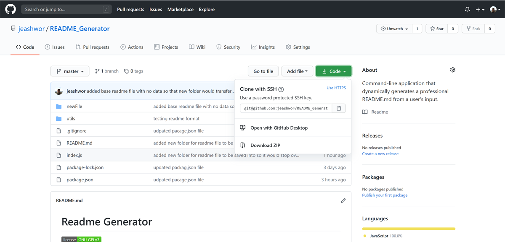
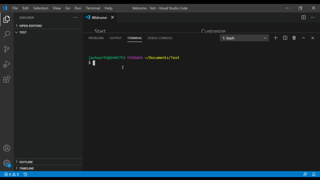
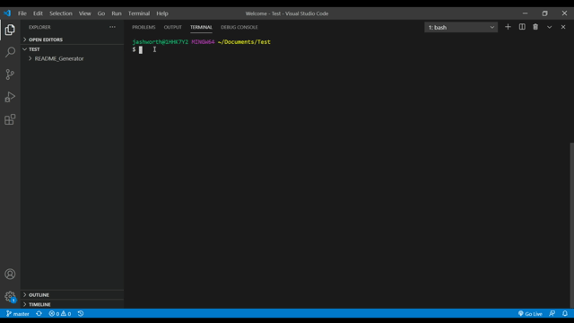

# Readme Generator


## Description
  
A quick and easy command-line based application that will create a professional README file based on prompted user input.  The ultimate goal in this application is to reduce the time that one would spend structuring a proper README file for their repository, and more time doing the important task of writing code!
  


  
## Table of Contents
  
* [Installation](installation-instructions)  
* [Usage](#usage-instructions)  
* [License](#license)  
* [Contributing](#contributing)  
* [Test](#test-instructions)  
* [Questions](#questions)

  
## Installation Instructions

* Follow [Link](https://github.com/jeashwor/README_Generator) to application GitHub repository.

* Locate Green "Code" button and select the clipboard to copy repo data.

* 

* Using your preferred terminal application navigate to your desired location to copy the repository folder using the git clone command along with the info copied from the GitHub page in the above step.

* 

* With in the terminal navigate to the newly cloned folder and run an npm install command to install necessary modules.

*

* You are now ready to run the application!


## Usage Instructions

* Application can be called using your command line from the README_Generator file director using the command:
```
node index.js
```
* Answer questions that follow to generate new README.md file in the newFile folder in this directory. 


## License

* Application licensed under MIT.  For more information see [license document](./utils/license.md).


## Contributing

Contributions to follow Contributor Covenant.  See below for more information.

[](https://www.contributor-covenant.org/)


## Test

* No test were created in initial programming of application.  Further development will include implementation of TDD principals.  


## Questions

Check out my GitHub page here:  [jeashwor's Page](https://github.com/jeashwor)

If you have additional questions please email me at jeashwor@gmail.com
